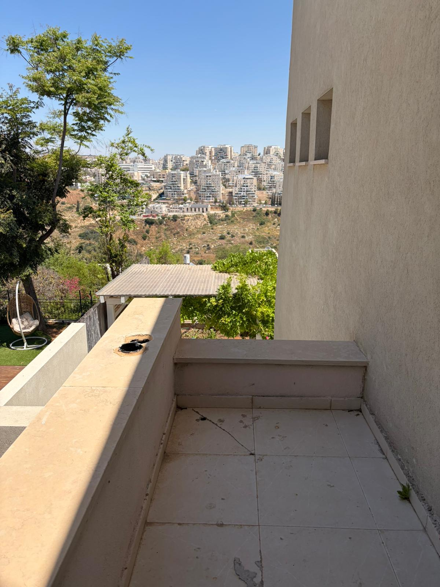
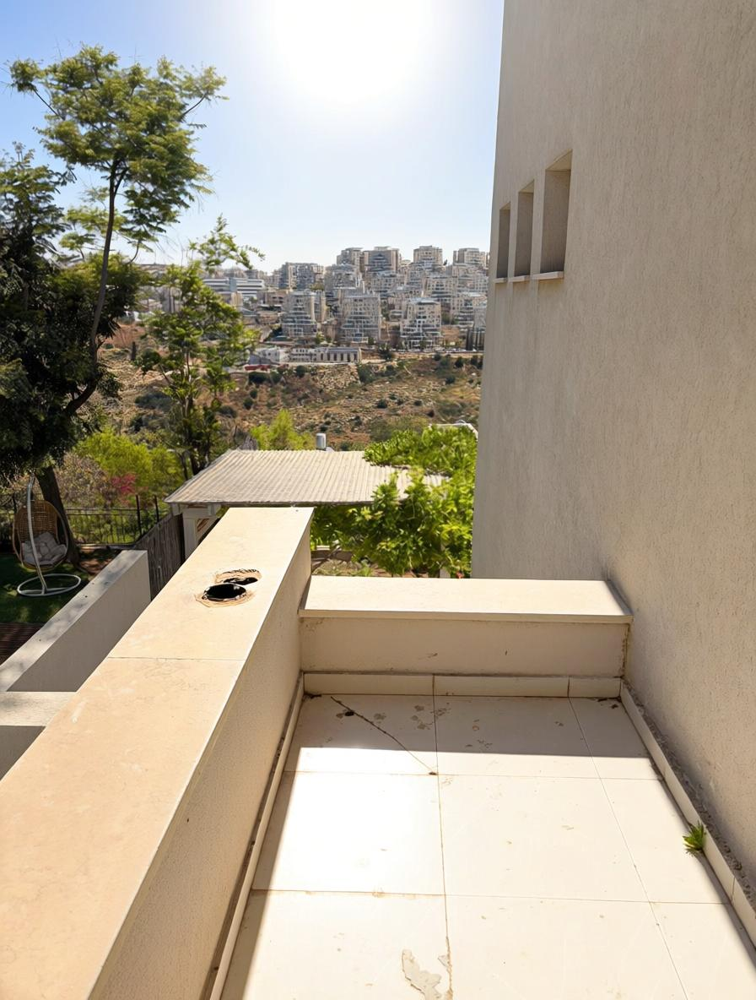

# PhysicEdit — Seminar Experiments
**Bar-Ilan University, 2026**

This repository contains seminar experiments built on top of [PhysicEdit](https://github.com/liangbingzhao/PhysicEdit) — a physics-aware image editing model introduced in the paper [*From Statics to Dynamics: Physics-Aware Image Editing with Latent Transition Priors*](https://arxiv.org/abs/2602.21778) (Zhao et al., ICML 2026).

All credit for the base model, architecture, and training framework belongs to the original authors.

---

## About PhysicEdit

Standard image editing models learn to map input images to outputs that look semantically correct, but they routinely violate physical laws — reflections that don't match geometry, lighting that ignores surface normals, shadows in the wrong direction. PhysicEdit addresses this by reformulating editing as a **physical state transition**: instead of learning a direct image-to-image mapping, the model leverages continuous dynamics to steer generation along physically plausible trajectories. It is trained on PhysicTran38K, a video-derived dataset where consecutive frames naturally encode physical transitions across five domains: Optics, Mechanics, Fluid, Thermal, and State Transition.

---

## Example: Inference on a Personal Photo

Running the full PhysicEdit model on a personal photo. The model edits the lighting of a balcony scene to simulate direct overhead sunlight — a Light Source Effects edit.

| Input | Output |
|---|---|
|  |  |

> Prompt: "The sun is directly overhead the balcony, casting bright uniform sunlight across the entire floor"  
> Model: PhysicEdit (full model) · Steps: 40 · Seed: 42

---

## Research Goal

The original PhysicEdit trains on all five physical domains (Optics, Mechanics, State Transition, etc.). We investigate two focused questions on the **Optics** domain:

1. **Experiment 1 — Domain Specialization**: Does training on Optics data only (instead of all 5 domains) improve performance on optical physics tasks?
2. **Experiment 2 — I-JEPA Supervision**: Does replacing the DINOv2 supervision signal with [I-JEPA ViT-H/14](https://github.com/facebookresearch/ijepa) provide better physical transition learning?

---

## Results

Evaluated on the optical subcategories of [PICABench](https://huggingface.co/datasets/Andrew613/PICABench) using GPT-4o scoring via [PICABench-eval](https://github.com/Andrew613/PICABench-eval).

| Model | LP | LSE | RFL | RFR | Overall |
|---|---|---|---|---|---|
| Backbone (no fine-tuning) | 62.95 | 61.19 | 62.90 | 55.26 | 59.58 |
| PhysicEdit — all 5 domains (paper) | 64.88 | 76.16 | 67.72 | 62.22 | 67.75 |
| **Exp 1: Optics only + DINOv2** | 56.25 | 65.40 | 55.60 | 38.62 | 55.58 |
| **Exp 2: Optics only + I-JEPA** | 54.12 | 66.71 | 55.80 | 43.17 | 56.09 |

> LP = Light Propagation · LSE = Light Source Effects · RFL = Reflection · RFR = Refraction  
> Backbone and paper numbers are taken from the original PhysicEdit paper.

### Takeaways

- **Domain specialization backfires**: both optical-only models score below even the untrained backbone. The paper's full 5-domain training provides cross-domain regularization that benefits optical tasks.
- **I-JEPA marginally outperforms DINOv2** (+0.5% overall, +4.6 on Refraction), but the difference is small.
- **Remove operations are hardest** for both models (~43%), well below add/replace (~67–70%).

Raw result files: `results/optics_dino/` and `results/optics_ijepa/`.

---

## What Changed from the Original

### Experiment 1 (branch: `main`)
- Training restricted to `PhysicTran38K/Optical_State` (6,244 samples, 1 epoch)
- Everything else identical to the original paper

### Experiment 2 (branch: `ijepa-switch`)
- DINOv2 supervision replaced with I-JEPA ViT-H/14 (`DiffSynth-Studio/diffsynth/pipelines/ijepa.py`)
- Added trainable linear projection 1280→768 to match downstream dimension
- Same Optics-only training data as Exp 1

---

## Evaluation

Inference on [PICABench](https://huggingface.co/datasets/Andrew613/PICABench) optical subcategories:

```bash
python scripts/inference/inference_pica.py \
  --base_model_path /path/to/Qwen-Image-Edit-2509 \
  --lora_path /path/to/checkpoint.safetensors \
  --output_path /path/to/output \
  --data_path /path/to/PICABench_cache \
  --physics_category Optics \
  --prompt_type intermediate \
  --num_inference_steps 40 \
  --seed 42
```

Scoring with PICABench-eval:

```bash
# Step 1: prepare metadata
python prepare_meta_info.py \
  --hf_repo Andrew613/PICABench \
  --output_image_dir /path/to/output \
  --save_dir /path/to/eval_dir \
  --allow_missing

# Step 2: GPT-4o scoring
export OPENAI_API_KEY="sk-..."
python PicaEval_gpt.py \
  --input_json_path /path/to/eval_dir/meta_info.json \
  --qa_field annotated_qa_pairs \
  --viz_mode crop_box_and_resize \
  --gpt_model gpt-4o \
  --num_workers 4
```

---

## Hardware

Training and inference ran on BIU HPC (H200 GPU, 141GB VRAM). Training: ~2.5h per experiment. Inference: ~41s/sample.

---

## Credits

This project is based on [PhysicEdit](https://github.com/liangbingzhao/PhysicEdit) by Zhao et al. (ICML 2026). The base model, architecture, DiffSynth-Studio framework, and PhysicTran38K dataset are all their work. Evaluation uses [PICABench](https://github.com/Andrew613/PICABench-eval) by the PICABench authors.
